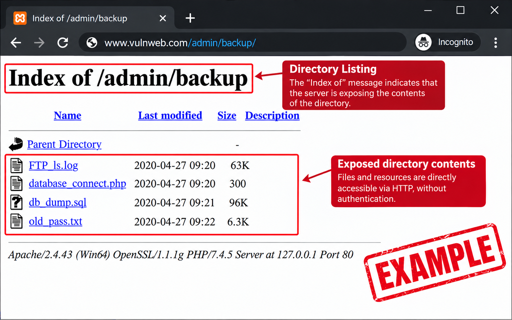

## Exploitation Context

During a web penetration test, I initiated the reconnaissance phase using a custom script that was already part of my toolkit.

Prior to the test, I had enhanced the script by adding new intelligence sources and integrations to expand its asset discovery capabilities.

It was during this phase that one of the investigation's most interesting findings emerged.

## Reconnaissance Phase

The first step was to run the reconnaissance script against the client's environment.

The tool utilized various sources to correlate infrastructure information, including services like VirusTotal, Shodan, and other intelligence feeds.

While analyzing the results, I identified an **IP address associated with the domain's original infrastructure**—information obtained via VirusTotal.

From that point on, the IP became part of the manual enumeration process.

```md
Recon
│
├── VirusTotal
├── Shodan
├── Other sources
│
▼
Identified IP
```

## The IP That Revealed Something Different

When accessing the domain normally, the application behaved as expected.

However, accessing the IP identified during web reconnaissance directly yielded different behavior.

Instead of the application, the server returned a **directory listing**. Initially, the discovery drew attention precisely because of the difference in behavior between:

```md
https://alvo.com.br
↓
Web Application

https://[IP]
↓
Directory Listing
```


Directory Listing Example

Based on this result, the enumeration shifted to focus on the content exposed by the server.

## Discovering the `.git` directory

While analyzing the directory listing, a `.git` directory was identified.

The next step was to determine what could be obtained from this exposure.

The repository contained information that allowed for a deeper analysis of the code and its files.

The penetration test then focused on searching for sensitive information and hardcoded data.

---

## Administrative credentials

During the analysis of the repository's contents, authentication details related to an administrative account were found.

Using these credentials, it was possible to access the application's administrative panel.

The investigation thus evolved from an infrastructure discovery into an actual compromise of the application.

---

## From the panel to the server

Following the administrative access, the investigation continued within the environment.

Subsequently, it was possible to obtain **root access to the server**.

The complete chain of events looked like this:

```text
Reconnaissance
↓
IP discovery
↓
Direct IP access
↓
Directory Listing
↓
.git exposure
↓
Repository analysis
↓
Administrative credentials
↓
Panel access
↓
Root access
```

---

I decided to make the script for my toolkit available on my GitHub:
https://github.com/AnkhCorp/Nuke.sh