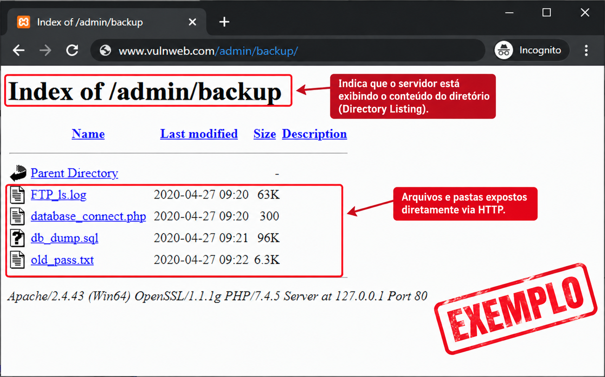

## Contexto da exploração

Durante um pentest web, iniciei a etapa de reconhecimento utilizando um script próprio que já fazia parte do meu arsenal de ferramentas.

Antes do teste, havia aprimorado o script, adicionando novas fontes de inteligência e integrações para ampliar a capacidade de descoberta de ativos.

Foi durante essa etapa que surgiu um dos resultados mais interessantes da investigação.

## Etapa de Reconhecimento

O primeiro passo foi executar o script de reconhecimento contra o ambiente do cliente.

A ferramenta utilizava diferentes fontes para correlacionar informações sobre a infraestrutura, incluindo serviços como VirusTotal, Shodan e outras fontes de inteligência.

Durante a análise dos resultados, foi identificado um **IP associado à infraestrutura original do domínio**, informação obtida através do VirusTotal.

A partir desse ponto, o IP passou a fazer parte da enumeração manual.

```md
Recon
  │
  ├── VirusTotal
  ├── Shodan
  ├── Outras fontes
  │
  ▼
IP identificado
```

## O IP que revelou algo diferente

Ao acessar o domínio normalmente, a aplicação apresentava o comportamento esperado.

Porém, ao acessar diretamente o IP identificado durante o reconhecimento web, o comportamento era diferente.

Em vez da aplicação, o servidor retornava um **Directory Listing**.

Inicialmente, a descoberta chamou atenção justamente pela diferença de comportamento entre:

```md
https://alvo.com.br
        ↓
Aplicação Web

https://[IP]
        ↓
Directory Listing
```


Exemplo Directory Listing

A partir desse resultado, a enumeração passou a ser direcionada para o conteúdo exposto pelo servidor.

## A descoberta do `.git`

Durante a análise do Directory Listing, foi identificado um diretório `.git`.

O próximo passo foi verificar o que poderia ser obtido a partir dessa exposição.

O repositório continha informações que permitiam realizar uma análise mais aprofundada do código e de seus arquivos.

O Pentest foi então direcionada para a busca de informações sensíveis e dados hardcoded.

---

## Credenciais administrativas

Durante a análise do conteúdo do repositório, foram encontradas informações de autenticação relacionadas a uma conta administrativa.

A partir dessas credenciais, foi possível acessar o painel administrativo da aplicação.

A investigação, portanto, evoluiu de uma descoberta de infraestrutura para um comprometimento efetivo da aplicação.

---

## Do painel ao servidor

A partir do acesso administrativo, a investigação continuou dentro do ambiente.

Posteriormente, foi possível obter **acesso root ao servidor**.

A cadeia completa ficou assim:

```text
Reconnaissance
      ↓
Descoberta do IP
      ↓
Acesso direto ao IP
      ↓
Directory Listing
      ↓
Exposição do .git
      ↓
Análise do repositório
      ↓
Credenciais administrativas
      ↓
Acesso ao painel
      ↓
Acesso root
```

---

Decidi disponibilizar o script do meu arsenal de ferramentas no meu Github:
https://github.com/AnkhCorp/Nuke.sh
