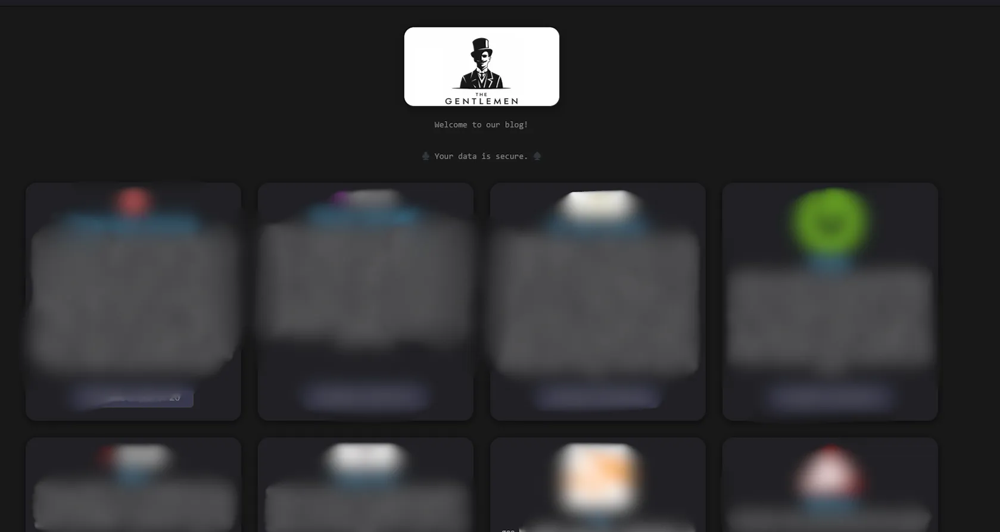
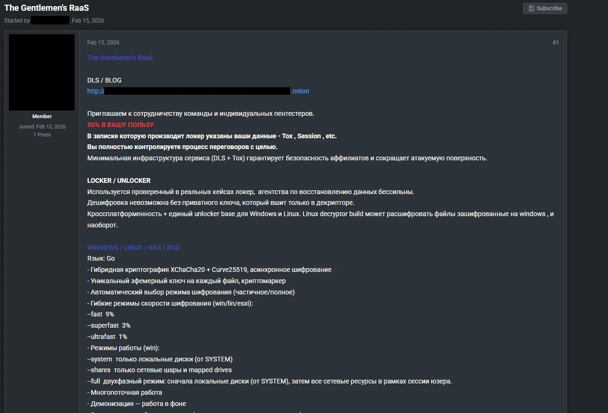
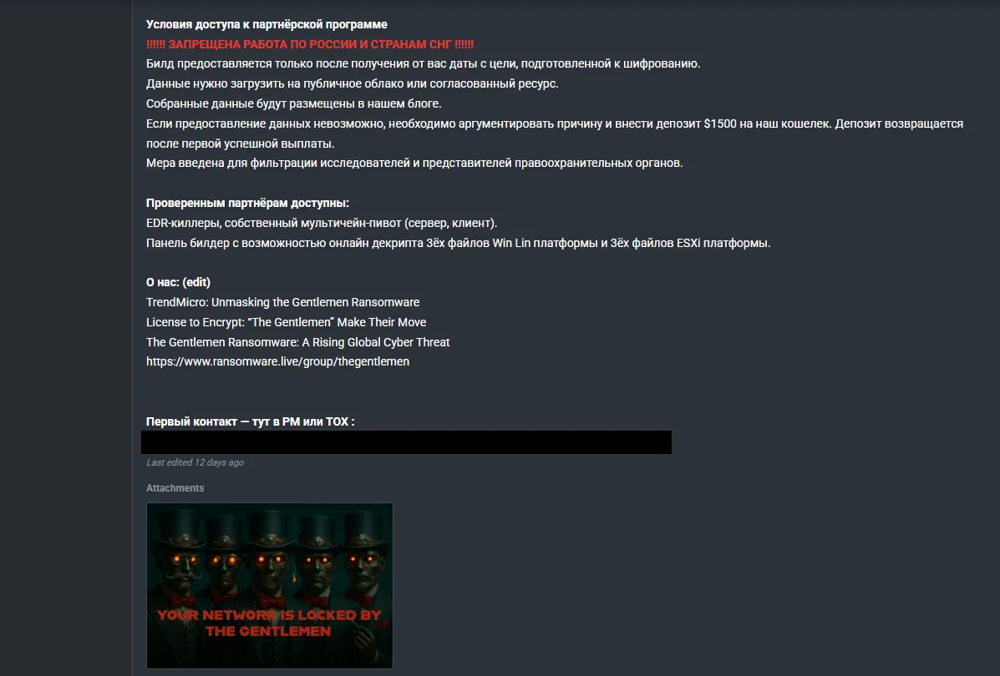
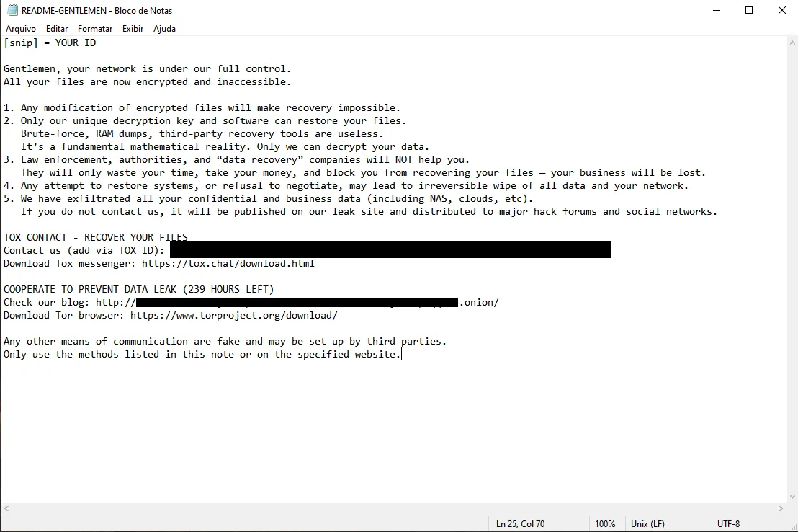

## Contexto da Ameaça

**The Gentlemen** é um grupo de Ransomware que realiza diversos ataques ao redor do mundo e tem chamado uma atenção interessante recentemente principalmente pela concentração de vítimas em países com menor maturidade em segurança cibernética.

Eles seguem ativos com a primeira aparição em meados de 2025.

**Principais países-alvo:**

- EUA, Brasil, Tailândia e Índia

**Principais setores-alvo:**

- Logística, Manufatura, Serviços Financeiros e Saúde

**Primeira vítima conhecida:**

- JN Aceros (Peru) em 30/06/2025



O núcleo do **TheGentlemen** é um sistema de chaves únicas geradas para cada vítima no momento do ataque. Cada arquivo é criptografado com uma chave própria, criada temporariamente durante o processo. Essa chave é então protegida usando uma chave pública controlada pelo grupo criminoso e adicionada ao final do arquivo.

Sem a chave privada correspondente - que fica apenas nos servidores dos atacantes - não é possível recuperar os arquivos. O descriptografador que eles fornecem após o pagamento já contém essa chave privada escondida e ofuscada dentro do próprio programa. Por isso ele consegue funcionar offline e em diferentes sistemas: ele simplesmente extrai essa chave e usa as informações armazenadas nos arquivos para reverter a criptografia.

O grupo segue o modelo **Double-Extortion**. Os dados são extraídos dos servidores da vítima antes de iniciar a encriptação e se o ransom não for pago os dados serão publicados de qualquer forma no site do grupo na rede onion.



## Modelo de Criptografia e Programa de Afiliados

A infraestrutura principal do grupo se passa por (DLS + TOX). O grupo trabalha com o clássico Ransomware-as-a-Service - onde desenvolvedores criam o malware e afiliados executam os ataques. Eles proibem que membros residentes da Russia e da CEI trabalhem no grupo.

**CEI** = Comunidade dos Estados Independentes, formada por alguns países que faziam parte da antiga união soviética, como: Belarus, Cazaquistão, Armênia, Quirguistão, entre outros.

O grupo ataca diversos tipos de serviços. Windows, Linux/BSD, NAS, ESXi(vitualization).

Embora o grupo tenha atacado alguns nichos específicos nos últimos meses, isso indica que não há um foco em empresas de algum seguimento. Eles podem atacar Empresas médias e grandes, Hospitais, Indústrias, Provedores e etc. Eles tem uma forte presença online e um método de extorsão agressivo, sendo um dos principais grupos de Ransomware da atualidade.



les exigem que interessados em participar do grupo justifiquem sua candidatura e realizem um depósito de US$ 1.500. De acordo com o grupo esse valor será reembolsado após o primeiro pagamento bem-sucedido. Segundo o anuncio a medida tem como objetivo filtrar pesquisadores e (Law enforcement agents). Esse mecanismo de recrutamento funciona como uma barreira de entrada e mostra uma boa preocupação com OPSEC.

Assim como a maioria dos grupos Ransomware, eles utilizam Tox e Session para se comunicar.



## TTPs

**Acesso Inicial:**

- T1190 (Explorar Aplicação Exposta) usando FortiGate e FortiOS (CVE-2024-55591)
- T1110 (Força Bruta)
- VPNs e painéis administrativos
- Uso de credenciais comprometidas (VPN e admin)

**Reconhecimento:**

- Scanner de IP Avançado
- Mapeamento completo da rede antes da execução

**Evasão de Defesas:**

- BYOVD (Bring Your Own Vulnerable Driver) usando CVE-2025-7771
- Uso de drivers legítimos vulneráveis, por exemplo ThrottleBlood.sys
- Encerramento de EDR e antivírus em nível de kernel

**Movimentação Lateral:**

- Uso de ferramentas administrativas legítimas como PsExec e ferramentas internas seguindo o padrão LOLBins, inferido e comumente observado em campanhas
- Ambientes complexos de Active Directory

## IoCs (Indicadores de Comprometimento)

**String identificada:** `Ransom Protection(DON'T DELETE)`

**Amostras conhecidas (SHA256):**

```
3ab9575225e00a83a4ac2b534da5a710bdcf6eb72884944c437b5fbe5c5c9235
51b9f246d6da85631131fcd1fabf0a67937d4bdde33625a44f7ee6a3a7baebd2
```

**Ferramentas e Binários:**

- All.exe
- ThrottleBlood.sys
- Allpatch2.exe

## Recomendações Preventivas

- Aplique os patches imediatamente no FortiGate e FortiOS
- Desabilite o acesso administrativo exposto à internet
- Imponha MFA em VPNs e painéis administrativos
- Faça rotação periódica de credenciais privilegiadas
- Monitore logins anômalos com base em geografia, horário e volume
